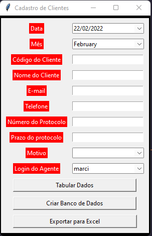

# Cadastro De Clientes

### Screenshots do Projeto:
  

### Como rodar o projeto:

**Você pode copiar o projeto e rodá-lo localmente, segue abaixo 3 passos para poder utilizar o projeto!**

1. Clique no botão para criar um novo banco de dados para salvar os dados que você irá tabular
2. Insira os dados que o cliente está fornecendo
3. Clique em tabular dados e estará pronto para cadastrar o próximo cliente
4. Após cadastrar todos os cliente você poderá usar tanto o banco de dados quanto clicar no botão "Exportar para excel", desta forma todos os dados do banco serão convertidos
para excel.

OBS: Poderá ser utilizado por mais de um agente para tabular os dados, desde que todos tenham acesso ao banco de dados (que poderá ficar salvo na rede e alterado o caminho no Script.

Projeto surgiu com a necessidade de desta ferramenta no meu local de trabalho, onde trouxe uma amostra para vocês do que está sendo utilizado.

Ainda está em desenvolvimento e sinto a necessidade de colocar algumas validações e passar a utilizar o sqlite ao invés do Excel.

